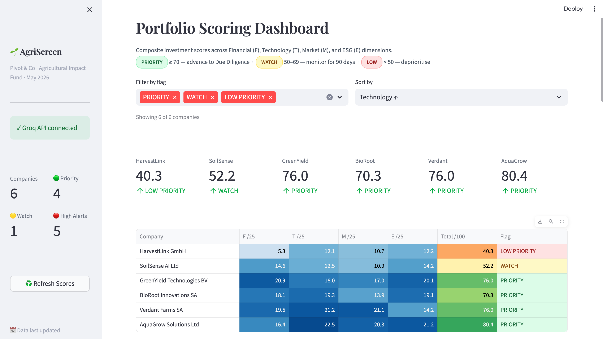
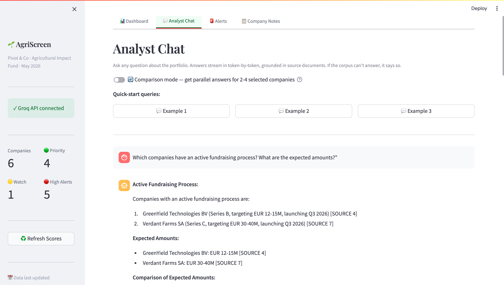
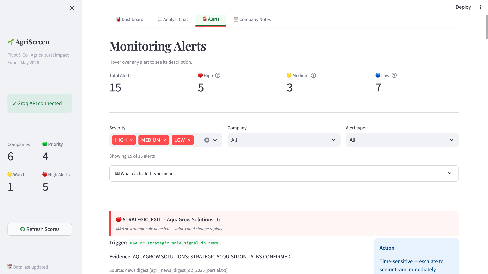
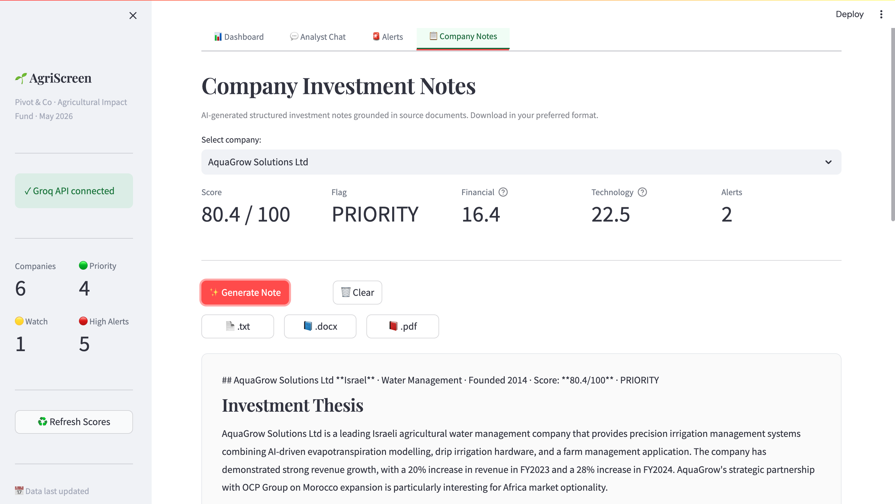

# 🌱 AgriScreen

**AI-Powered Agricultural Investment Screening**
Pivot & Co — Take-Home Assessment · May 2026

AgriScreen is a portfolio-screening tool that ingests company factsheets, news, financials and an ESG framework, then scores 6 agricultural-tech companies across Financial, Technology, Market, and ESG dimensions. It surfaces investment-grade insights through a Streamlit dashboard with RAG-powered chat, automated alerts, and downloadable investment notes.



---

## Quick Start

```bash
# 1. Install dependencies
pip install -r requirements.txt

# 2. Set your Groq API key
echo "GROQ_API_KEY=your_key_here" > .env

# 3. Build the FAISS index from source documents
python3 test_ingestion.py

# 4. Launch the app
TOKENIZERS_PARALLELISM=false OMP_NUM_THREADS=1 streamlit run app.py
```

Open `http://localhost:8501`. First load takes ~60 seconds (runs full scoring pipeline). Subsequent navigation is instant via caching.

---

## Architecture
```
┌───────────────────┐
              │   Source Data     │
              │  (factsheets,     │
              │   news, reports,  │
              │   CSVs)           │
              └─────────┬─────────┘
                        │
              ┌─────────▼─────────┐
              │   Ingestion       │
              │   Loader →        │
              │   Chunker →       │
              │   Embedder →      │
              │   FAISS Index     │
              └─────────┬─────────┘
                        │
    ┌───────────────────┼───────────────────┐
    │                   │                   │
    **Design principle**: LLMs are used only for *grounded signal extraction* and *answer generation*. All scoring formulas, thresholds, and alert logic are deterministic Python — making every score reproducible and explainable.

```
---

## App Walkthrough

### Portfolio Dashboard

Six companies scored across four dimensions with sortable heat-mapped totals, drill-down score breakdown per company, and inline comparison view for 2-4 companies side-by-side.


### Analyst Chat with Streaming + Comparison Mode

Token-by-token streaming answers grounded in source documents. Toggle Comparison Mode to ask the same question across 2-4 companies in parallel, each with its own retrieved evidence.



### Monitoring Alerts

All seven alert types with severity colour-coding, full filter controls by severity/company/type, and every alert backed by a RAG-retrieved source quote.



### Company Investment Notes

AI-generated structured notes grounded in source documents. Download in three formats — `.txt`, `.docx`, `.pdf`.



---

## Project Structure
```
pivotco_assessment/
├── app.py                    # Streamlit app (4 tabs)
├── requirements.txt
├── README.md
├── .env.example              # GROQ_API_KEY template
│
├── data/                     # Source documents
│   ├── companies/            # 6 factsheets (.txt)
│   ├── news/                 # 2 news digests (.txt)
│   ├── reports/              # Sector + ESG framework
│   └── market_data/          # 2 financial CSVs
│
├── ingestion/                # Build the FAISS index
│   ├── loader.py             # Per-format loaders
│   ├── chunker.py            # Per-format chunking
│   ├── embeddings.py         # sentence-transformers
│   └── vector_store.py       # FAISS wrapper
│
├── rag/                      # Retrieval + LLM
│   ├── retriever.py
│   ├── qa_engine.py          # ask() + ask_stream()
│   └── prompts.py            # System prompt with hallucination guard
│
├── scoring/                  # Composite scoring
│   ├── financial.py          # CSV-driven (no LLM)
│   ├── technology.py         # Patent + AI signals
│   ├── market.py             # Hectares + investors + AI signals
│   ├── esg.py                # AI extracts → framework rules apply
│   └── composite.py          # Orchestrator
│
├── monitoring/               # Alerts + notes
│   ├── alerts.py             # 7 alert types
│   └── company_notes.py      # Structured investment notes
│
├── utils/
│   ├── company_meta.py       # Shared company metadata
│   ├── exporters.py          # MD → .txt / .docx / .pdf
│   ├── metadata.py           # ChunkMetadata schema
│   └── helpers.py
│
├── tests/
│   ├── test_validation.py    # End-to-end RAG, scoring, alert tests
│   └── checklist.md
│
├── test_scoring.py           # Integration smoke test for scoring pipeline
│
├── docs/
│   ├── architectural_brief.docx
│   └── screenshots/          # Dashboard, chat, alerts, notes PNGs
│
└── outputs/
├── index/                # FAISS index + chunks.pkl
└── notes/                # Generated .md notes

```
---

## Scoring Methodology

Each company is scored across 4 dimensions, each worth 25 points (total 100):

### Financial (0–25) — CSV only, deterministic
- Revenue CAGR 3y → `(rev_2025/rev_2023)^0.5 - 1`, scaled (0-10)
- Gross margin → `margin/80 × 7` (0-7)
- Runway (months) → tiered: 12+ months = 1pt minimum (0-5)
- EBITDA margin → tiered (0-3)

### Technology (0–25) — Hard signal + AI extraction
- `has_patent` → 8 points (hard signal from SCORING INPUTS)
- LLM rates ip_strength, data_moat, integration_maturity, benchmark_evidence (0-10 each)
- Python converts to weighted points (max 17)

### Market (0–25) — Structured + AI
- Market traction → log scale: `log10(ha+1)/log10(890001) × 7` (0-7)
- Investor conviction → tiered by total raised (0-8)
- LLM rates TAM, geography, competition, partnerships (max 10)

### ESG (0–25) — Framework-driven
- LLM extracts E/S/G evidence (water reduction %, certifications, CFO vacancy, revenue trend, SDGs, etc.)
- Python applies the rules from `data/reports/esg_scoring_framework_agriculture_v2_1.txt`
- E starts at 50, S at 50, G at 60 (governance baseline for funded startups)
- Red flags from framework: CFO vacancy −10, revenue declining −10, unverified claims −20
- Composite = (E+S+G)/3, dimension = composite/4

### Final Flag
- ≥ 70: **PRIORITY** — advance to Due Diligence
- 50-69: **WATCH** — monitor for 90 days
- < 50: **LOW PRIORITY** — deprioritise

---

## Monitoring Alerts

7 alert types, all evidence-backed:

| Type | Severity | Trigger | Source |
|---|---|---|---|
| `RUNWAY_CRITICAL` | HIGH | runway < 12 months | financials CSV + factsheet |
| `REVENUE_DECLINE` | HIGH | YoY revenue negative | financials CSV + factsheet |
| `GOVERNANCE_FLAG` | HIGH | leadership departure / CFO vacancy in news | news digest |
| `STRATEGIC_EXIT` | HIGH | M&A or sale process in news | news digest |
| `ESG_ALERT` | MEDIUM | composite < 60/100 (framework threshold) | scoring engine + factsheet |
| `FUNDRAISE_ACTIVE` | LOW | active round detected in news | news digest |
| `SCORE_PRIORITY` | LOW | total score ≥ 70 | scoring engine + factsheet |

Every alert includes: company, trigger, evidence (with numbers/quotes), source filename, and recommended action.

---

## Hallucination Prevention

Three-layer defence:
1. **System prompt** forbids using any information outside retrieved chunks
2. **Explicit refusal instruction**: if no evidence, respond exactly *"This cannot be answered from the available documents"*
3. **`temperature=0`** for deterministic, literal generation

**Verified**: tested with the impossible question *"Which company plans expansion into South America in 2028?"* — system correctly refuses.

---

## Validation

Two test suites cover different layers:

- **`test_scoring.py`** — integration smoke test for the full scoring pipeline,
  runs all 24 LLM extractions and confirms F+T+M+E sub-scores compose to a total
  in the expected range for every company.

- **`tests/test_validation.py`** — end-to-end validation across RAG, scoring,
  and alerts. Tests 5 grounded questions (including 1 deliberately impossible
  to verify the hallucination guard), checks all 7 alert types fire, and
  verifies every alert has trigger/evidence/source/action fields.

Run them:
```bash
python3 test_scoring.py             # ~60s, full pipeline
python3 tests/test_validation.py    # ~90s, end-to-end checks
```

---

## Key Technical Decisions

- **FAISS over Chroma/Pinecone** — local, no external service, sub-millisecond retrieval on 119 chunks
- **Groq + Llama 3.1 8B** — free tier, fast (200 tokens/sec), supports streaming
- **all-MiniLM-L6-v2** — 384-dim embeddings, balanced speed/quality, runs on CPU
- **temperature=0 everywhere** — reproducibility over creativity for investment analysis
- **`ChunkMetadata` dataclass** — typed schema for company, doc_type, section, news_id, date filtering
- **AI extracts → Python scores** — separation makes every score explainable in 30 seconds

---

## Known Limitations

Honest assessment of where the current system has rough edges:

1. **Cold-start latency** — First load is ~60 seconds because the scoring pipeline makes 24 LLM calls (6 companies × 4 dimensions). Subsequent navigation is instant due to Streamlit caching.

2. **LLM score variance** — Technology, Market, and ESG dimensions partially rely on LLM extraction, leading to ±5 point variance between runs. Financial scores (pure CSV) are fully deterministic.

3. **Keyword-based alert detection** — `FUNDRAISE_ACTIVE` and `GOVERNANCE_FLAG` use keyword matching on news text. This works well but misses context: e.g., a "Series A close" article gets flagged even when the round already closed.

4. **Single company per news chunk** — News articles mentioning multiple companies are tagged with only the first matched company in metadata. The text-level retrieval still finds them, but filter-based queries may miss multi-company articles.

5. **Date stored as string** — News article dates are stored as strings, not datetime objects, so date-range filtering would require a parsing step.

6. **No retrieval confidence threshold** — If the top retrieved chunk has low similarity (<0.4), the system still generates an answer. A production system would refuse below a confidence threshold.

---

## Production Improvements

What I would add for a production deployment:

1. **Cross-encoder reranking** — for corpora >10K chunks, two-stage retrieval (FAISS top-20 → cross-encoder top-5) measurably improves answer quality. Skipped here because marginal gain on 119 chunks.

2. **Document upload UI** — Streamlit file uploader → live ingestion into the FAISS index without restarting the app.

3. **Citation verification** — programmatic check that each `[SOURCE N]` claim in the LLM answer is actually present in the cited chunk.

4. **Retrieval confidence threshold** — if max similarity score < 0.40, return *"Insufficient evidence in the corpus"* instead of generating an answer.

5. **Pure unit tests for scoring formulas** — current tests are integration-level (full pipeline). Refactoring `scoring/financial.py` helper functions to be independently callable would enable millisecond unit tests of individual formulas (runway tiers, CAGR calculation, margin capping).

6. **Date-aware metadata** — store `date` as `datetime` not string, capture `last_updated` on factsheets, list of `companies_mentioned` per news chunk for multi-company articles.

7. **Slack / email alert delivery** — push HIGH severity alerts to analyst channels in real time.

8. **Versioned scoring** — tag every score with the scoring engine version so historical comparisons are valid.

9. **Reduce cold-start latency** — The initial scoring run takes ~60s because it makes 24 LLM calls. For production this should be replaced by:
   - **Persistent score caching**: Save scoring results to JSON/SQLite after each run. Only re-score when the underlying documents change (detected via file hashes).
   - **Background scoring service**: Run scoring on a schedule (e.g. nightly) rather than on every app launch. The Streamlit app would just read the latest cached scores.
   - **Parallel LLM calls during scoring**: The current scoring pipeline calls Groq sequentially for the 24 extraction operations. Running them concurrently (with a worker pool of 4-6) would reduce scoring time from ~60s to ~15s.

10. **Reduce per-query latency** — Each chat query takes 2-4 seconds (retrieval + Groq). Optimisations:
    - Cache the embedding model in memory across all queries (already done via `@st.cache_resource`)
    - Cache frequent query embeddings — analyst questions often repeat
    - The comparison Q&A already uses concurrent retrieval for parallel company queries


Built by **Purnima Prabha** for Pivot & Co · May 2026
